# Effisend - Base Mini App

Effisend reimagines digital payments by combining the security of biometric authentication with the convenience of conversational AI, all within the trusted **Base App ecosystem** as a native Mini App. Built on the **Base** blockchain and integrated seamlessly into Base's growing user base, our platform makes crypto transactions as simple as showing your face or having a chat with our AI assistant, DeSmond — no app downloads required.

## 🔗 Fast Links

### Mobile Only: Use on Base App Mobile app for Face-ID features.
**BASE MINI APP**: [LAUNCH APP](https://effisend-base.expo.app/)

**DUNE ANALYTICS**: [DUNE DASHBOARD](https://dune.com/altaga/effisend)

**CONTRACTS DEPLOYED**:
- BatchBalances: [LINK](https://basescan.org/address/0x31C0e6E622116EE00e8d6DbBf845759BE17e6D93)

**PITCH DECK**: [LINK](https://docsend.com/v/c8qkn/effisendforbatches)

## 🎯 Project Value & Justification

**Enabling Face Payments within Base App represents a paradigm shift in digital finance accessibility.**

Traditional crypto payments require complex wallet management, private key security, and technical knowledge that creates barriers for mainstream adoption. Effisend eliminates these friction points by introducing **biometric-authenticated payments directly within Base App**—the platform users already trust for their onchain activities.

### Why This Matters:

- **Zero Learning Curve**: Users can make crypto payments using familiar Base App interface with just their face—no new apps, no wallet setup, no seed phrases to remember
- **Instant Trust**: Base's established reputation and user base provides immediate credibility for crypto transactions
- **Biometric Security**: Face authentication offers stronger security than passwords while being more user-friendly than traditional wallet management
- **Social Integration**: Payments become as natural as casting on Base, enabling peer-to-peer transactions within existing social contexts
- **Mass Market Ready**: Transforms crypto from a niche technology into an accessible payment method for Base's growing user community

By bringing **Face Payments to Base App**, Effisend bridges the gap between Web3 innovation and mainstream usability, making cryptocurrency payments as intuitive as taking a selfie.

## ⚙️ System Architecture & Tech Stack

We've designed Effisend with a modern Web3 architecture that prioritizes what matters most: speed, security, and simplicity. Every component works together to create an experience that feels familiar yet powered by cutting-edge blockchain technology.

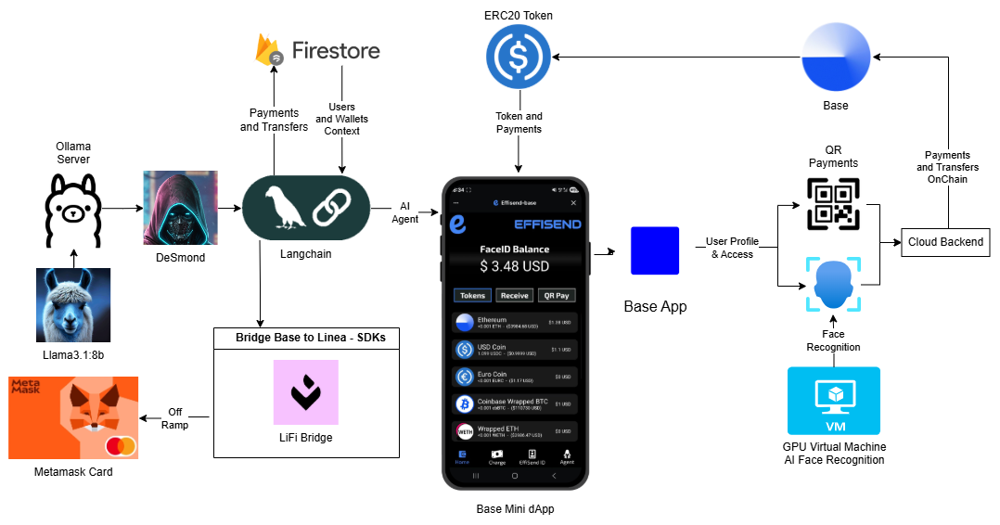

*(The system diagram illustrates how the Effisend frontend and backend services interact with the Base network. USDC is shown as the primary asset for rewards and payments.)*

### Base & Farcaster Components:

  - [**Farcaster Mini App SDK:**](https://docs.base.org/mini-apps/quickstart/migrate-existing-apps) The SDK enables seamless authentication, profile access, and social features within Base's trusted ecosystem. Our Base provider manages the entire lifecycle from initialization to user authentication, ensuring Effisend works flawlessly whether accessed through Base mobile app.

  - [**Base Network:**](https://base.org/)
    Our blockchain of choice for its high-performance infrastructure and developer-friendly environment. Base's Ethereum L2 architecture perfectly matches our vision of making crypto payments feel instant and affordable, whether you're buying coffee or sending money worldwide.

  - [**USDC:**](https://www.circle.com/usdc)
    We chose USDC as our primary currency because stability matters when you're dealing with real money. No one wants to worry about price volatility when splitting a dinner bill or earning rewards for platform activity.

  - [**Langchain (AI Agent):**](https://www.langchain.com/)
    The brain behind DeSmond, our conversational AI assistant. Instead of navigating complex interfaces, users can simply tell DeSmond what they want.

  - [**DeepFace:**](https://viso.ai/computer-vision/deepface/)
    The technology that makes our Face-ID system both secure and user-friendly. With built-in anti-spoofing protection, you can trust that only you can access your wallet—no passwords to remember, no keys to lose.

## 🚀 Features

- **Face-ID Authentication**: Secure biometric payments using facial recognition
- **AI Assistant (DeSmond)**: Conversational AI for wallet operations and DeFi interactions
- **Base Network Integration**: Native support for ETH, USDC, EURC, cbBTC, WETH, and LINK
- **Real-time Payments**: Instant crypto transactions with Face-ID and QR code support
- **Rewards System**: Earn rewards for platform engagement and transactions

Effisend makes crypto payments as easy as snapping a selfie, scanning a QR code, or messaging DeSmond.

## 🤳 FaceID

Effisend enables seamless and secure payments through facial recognition and linking a user's unique biometric profile directly to their wallet.

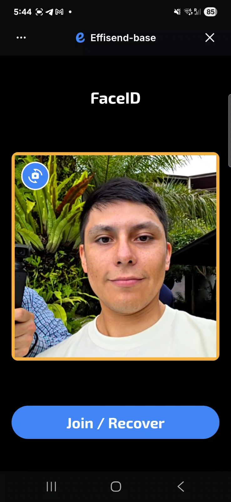 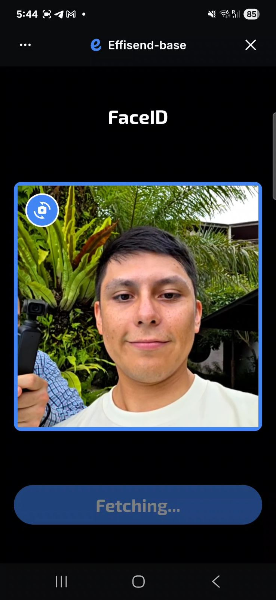 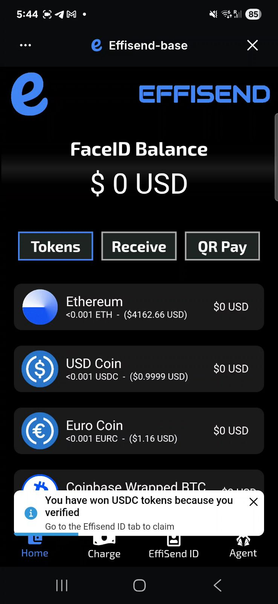

## 💳 Payments

We've streamlined the payment experience around **USDC** because predictable value matters in everyday transactions. Whether you're a merchant accepting payments or a customer making purchases, you shouldn't have to worry about price swings affecting your transaction.

- The merchant or user initiates a payment request. Afterward, the customer's QR code—similar to digital wallets—or facial recognition is scanned. Once verified, the system displays the available tokens, allowing the user to proceed with the payment.

  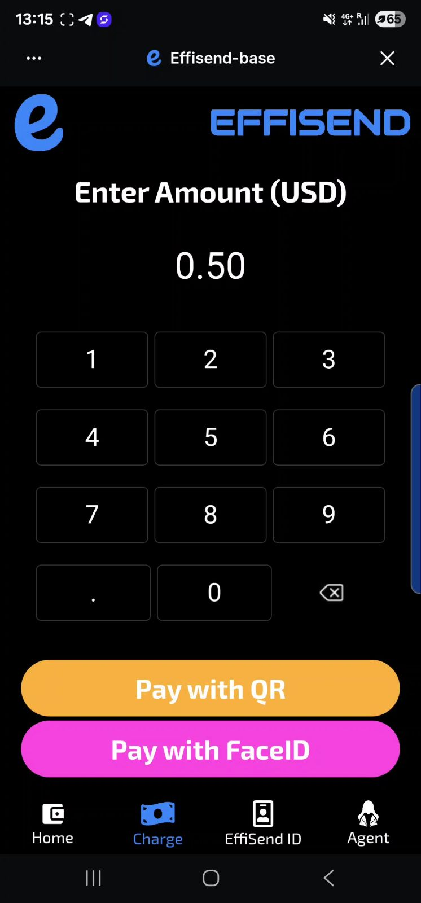 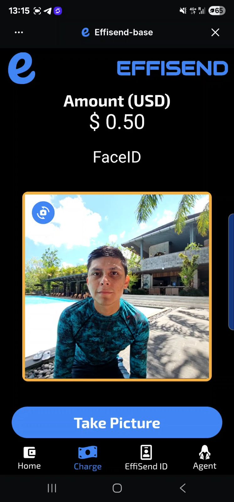 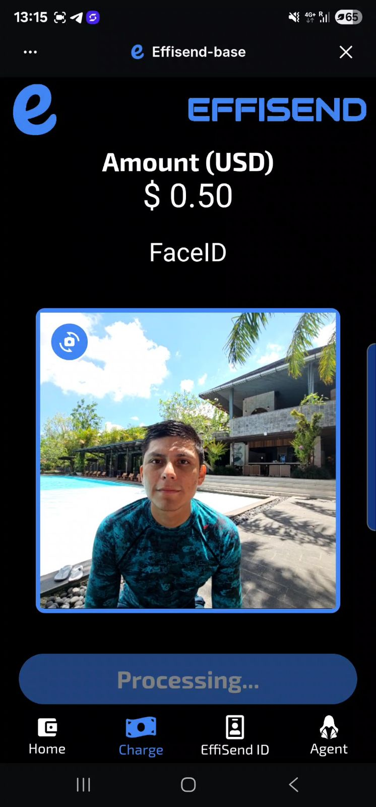

- Every transaction generates a permanent record on the blockchain and a digital receipt for your records. Need proof of payment? It's all there, verifiable and tamper-proof, with the option to print or email receipts for traditional record-keeping.

  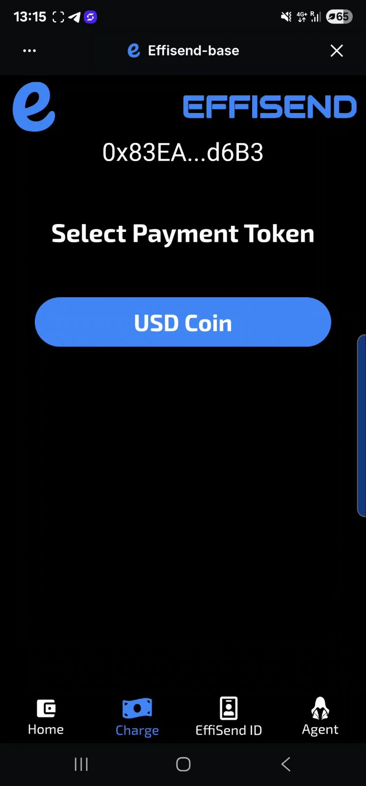 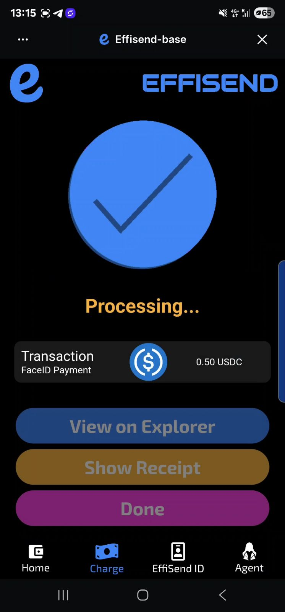 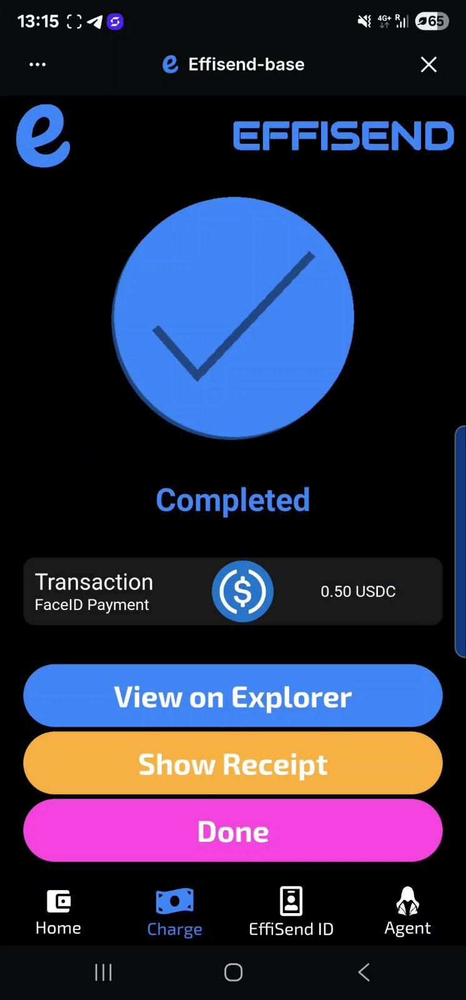

## 🎁 Rewards

Effisend's identity-based rewards model encourages platform engagement. Users earn **USDC** tokens for completing a certain number of transactions or actions, fostering a vibrant and active community.

 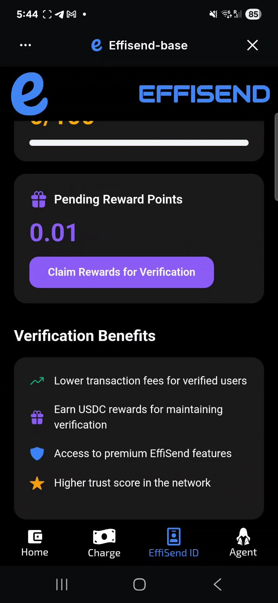 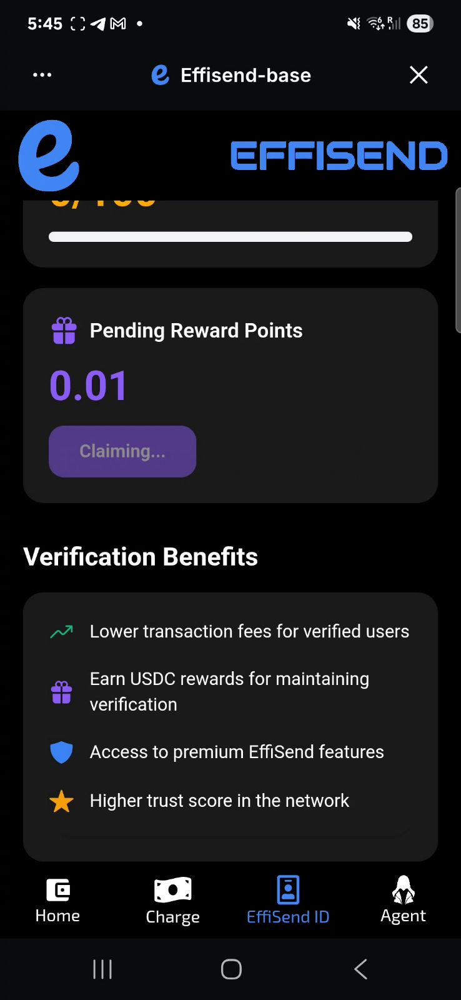

Your **Trust Score** grows with your on-chain reputation. We analyze your transaction patterns and community involvement on Base to identify engaged, trustworthy users. Higher trust scores unlock better rewards and personalized recommendations—it's like a credit score, but for the decentralized world.

## 🤖 AI Agent (DeSmond)

Meet **DeSmond**, your personal crypto assistant who speaks human, not blockchain jargon. Built with **Langchain**, DeSmond turns complex wallet operations into simple conversations. Just tell him what you want to do with your money, and he'll handle the technical details.

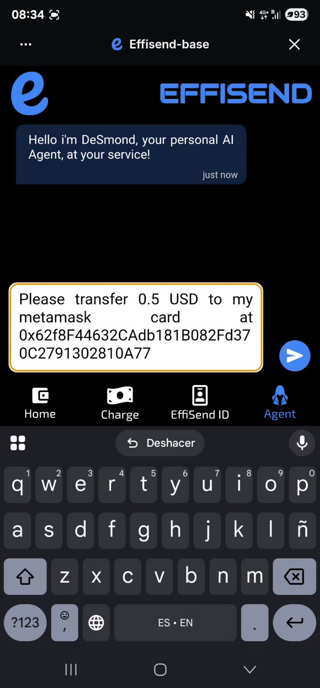 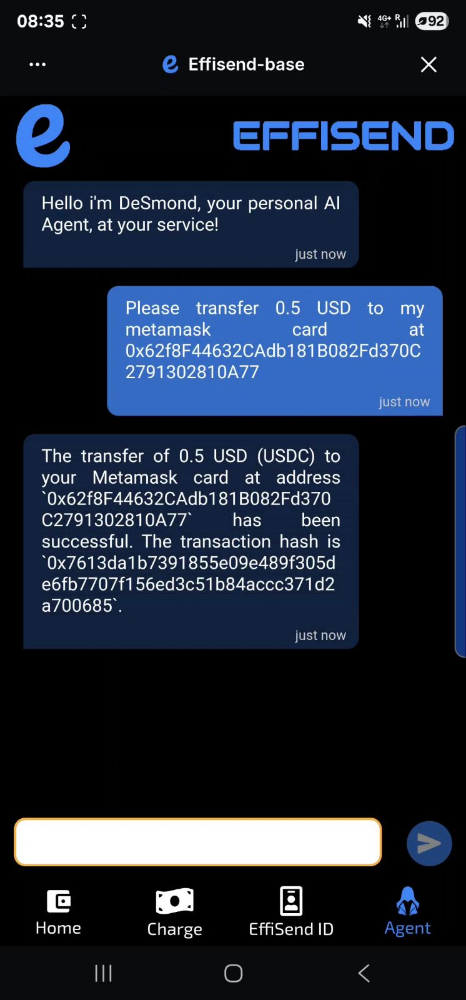 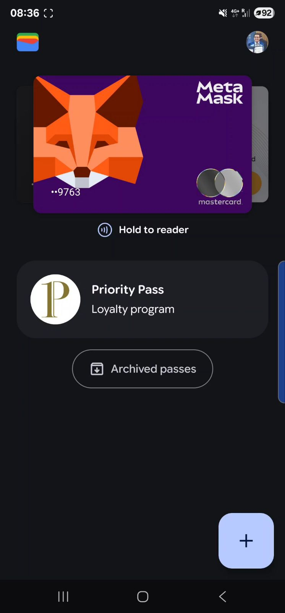

### Agent Tools & Capabilities

DeSmond is smart enough to understand context and intent, then choose the right action for your request. Here's what he can help you with:

**Core Wallet Functions:**
- **`get_balance_base`**: Retrieves your current token balance for any token on Base Mainnet
- **`transfer_tokens`**: Facilitates token transfers on the Base Mainnet
- **`swap_tokens`**: Enables token swaps on Base using integrated DEX routing

**Payment Card Integration:**
- **`fund_kast_card`**: Transfers USDC from Base to Kast Card for traditional spending
- **`fund_metamask_card`**: Transfers USDC from Base to Metamask Card on Linea

**Utility Functions:**
- **`list_of_tools`**: Shows all available DeSmond capabilities
- **`fallback`**: Provides friendly responses when your intent needs clarification

### Key Features:

- **LiFi Integration**: Uses LiFi SDK for optimal cross-DEX routing on Base
- **Smart Approvals**: Automatically handles ERC20 token approvals before swaps
- **Cheapest Routes**: Orders swaps by cheapest available rates

## 💰 Supported Tokens

| Token Name           | Symbol | Contract Address                             |
| -------------------- | ------ | -------------------------------------------- |
| Ethereum             | ETH    | Native Token                                 |
| USD Coin             | USDC   | `0x833589fCD6eDb6E08f4c7C32D4f71b54bdA02913` |
| Euro Coin            | EURC   | `0x60a3E35Cc302bFA44Cb288Bc5a4F316300390405` |
| Coinbase Wrapped BTC | cbBTC  | `0xcbB7C0000aB88B473b1f5aFd9ef808440eed33Bf` |
| Wrapped ETH          | WETH   | `0x4200000000000000000000000000000000000006` |
| Chainlink            | LINK   | `0x88Fb150BDc53A65fe94Dea0c9BA0a6dAf8C6e196` |

All technical implementations for this module are included here.

## 📄 License

This project is licensed under the MIT License.

## 📚 Resources & Links

- [Base App](https://www.base.org/)
- [Base Network Documentation](https://docs.base.org/)
- [Farcaster Mini App SDK](https://github.com/farcasterxyz/miniapp-sdk)
- [Expo Documentation](https://docs.expo.dev/)
- [React Native Documentation](https://reactnative.dev/)

---

Built with ❤️ for Base App and the global onchain economy.
